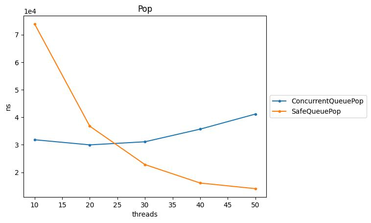
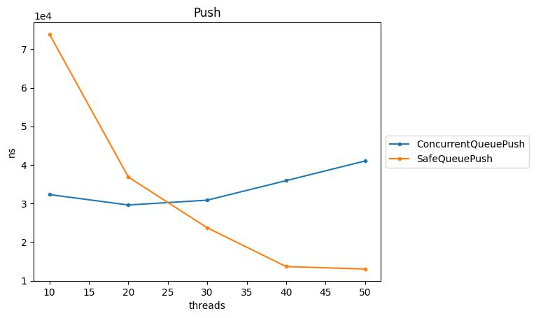

<p align="right">
  
</p>

# kpsr-queue-benchmarks
Klepsydra queue benchmarks

# Installation Instructions

## System dependencies

* Ubuntu 14.04 or above
* Cmake 3.5.1 or above
* gcc for C++11 5.4.0 or above.
* Google Test (https://github.com/google/googletest)
* Google Benchmark (https://github.com/google/benchmark)


## Klepsydra dependencies

* [kpsr-sdk](https://github.com/klepsydra-technologies/kpsr-sdk)
* [kpsr-core](https://github.com/klepsydra-technologies/kpsr-core)

## Installation

Given `$KLEPSYDRA_HOME`, for example `~/klepsydra`

```bash
cd $KLEPSYDRA_HOME
git clone https://github.com/klepsydra-technologies/kpsr-queue-benchmarks
cd kpsr-queue-benchmarks
mkdir build
cd build
cmake ..
make
```
## Run benchmarks

Benchmarks can be run individually by the following command:

```bash
cd kpsr-queue-benchmarks/build
./bin/queue_benchmarks_<name_of_the_benchmark>
```
Or run all benchmarks one after the other with the following command:

```bash
cd kpsr-queue-benchmarks/build/bin
for benchmark in *; do ./$benchmark; done
```

## Overview
Each benchmark measures the cpu impact of *push* and *pop* method implementations of the three target classes. The three classes implement two different queues: 
1. kpsr::mem::SafeQueue: a Klepsydra implemented thread-safe asynchronous blocking queue.
2. moodycamel::ConcurrentQueue: a thread-safe data structure that allows multiple threads to access it simultaneously. It is a specialized type of queue that is designed to handle multiple concurrent producers-consumers scenarios.

## Method Definition
The measured methods are defined as follows:
- *push*: inserts the given element to the end of the queue.
- *pop*: removes an element from the front of the queue.

## Method correspondence for each class

### SafeQueue
  #### Pop
    Pops item from the queue. If queue is empty, this function blocks until item becomes available.
  #### Push
    Pushes the item into the queue. It blocks if the queue is full.

### ConcurrentQueue
  #### Pop (Dequeue)
    When a thread wants to remove an element from the queue, it locks the necessary data structures to ensure mutual exclusion, preventing other threads from modifying the queue simultaneously. The thread then removes the element and unlocks the data structures, allowing other threads to access the queue.
  #### Push (Enqueue)
    When a thread wants to add an element to the queue, it also locks the necessary data structures to ensure mutual exclusion, preventing other threads from modifying the queue at the same time. This guarantees that only one thread at a time can add an element. 


# Multithread Results
|    | type          | collection      | operation   |   threads |   real_time |   iterations |
|---:|:--------------|:----------------|:------------|----------:|------------:|-------------:|
|  0 | std::string   | ConcurrentQueue | Pop         |        10 | 3.18245e+04 |        21670 |
|  1 | std::string   | ConcurrentQueue | Pop         |        20 | 2.99636e+04 |        20000 |
|  2 | std::string   | ConcurrentQueue | Pop         |        30 | 3.10902e+04 |        25320 |
|  3 | std::string   | ConcurrentQueue | Pop         |        40 | 3.56778e+04 |        26680 |
|  4 | std::string   | ConcurrentQueue | Pop         |        50 | 4.11454e+04 |        22650 |
|  5 | std::string   | SafeQueue       | Pop         |        10 | 7.38722e+04 |         8960 |
|  6 | std::string   | SafeQueue       | Pop         |        20 | 3.67521e+04 |        18300 |
|  7 | std::string   | SafeQueue       | Pop         |        30 | 2.28104e+04 |        29640 |
|  8 | std::string   | SafeQueue       | Pop         |        40 | 1.61090e+04 |        38240 |
|  9 | std::string   | SafeQueue       | Pop         |        50 | 1.40615e+04 |        47500 |





|    | type             | collection      | operation   |   threads |   real_time |   iterations |
|---:|:-----------------|:----------------|:------------|----------:|------------:|-------------:|
|  0 | std::string      | ConcurrentQueue | Push        |        10 | 3.23134e+06 |        22360 |
|  1 | std::string      | ConcurrentQueue | Push        |        20 | 2.96061e+06 |        24560 |
|  2 | std::string      | ConcurrentQueue | Push        |        30 | 3.08553e+07 |        28380 |
|  3 | std::string      | ConcurrentQueue | Push        |        40 | 3.59165e+07 |        26520 |
|  4 | std::string      | ConcurrentQueue | Push        |        50 | 4.10087e+07 |        25150 |
|  5 | std::string      | SafeQueue       | Push        |        10 | 7.38703e+07 |         9250 |
|  6 | std::string      | SafeQueue       | Push        |        20 | 3.68462e+07 |        17940 |
|  7 | std::string      | SafeQueue       | Push        |        30 | 2.37039e+07 |        27780 |
|  8 | std::string      | SafeQueue       | Push        |        40 | 1.36507e+07 |        44640 |
|  9 | std::string      | SafeQueue       | Push        |        50 | 1.30115e+07 |        66800 |





# License

&copy; 2023 Klepsydra Technologies AG, all rights reserved. Licensed under the terms in [LICENSE.md](./LICENSE.md)

This software and documentation are 2023 Klepsydra Technologies AG
Limited and its licensees. All rights reserved. See [license file](./LICENSE.md) for full copyright notice and license
terms.

# Contact

https://www.klepsydra.com
support@klepsydra.com